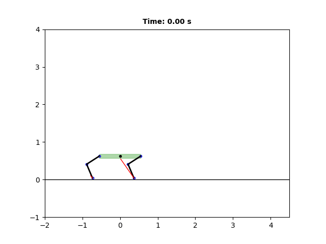
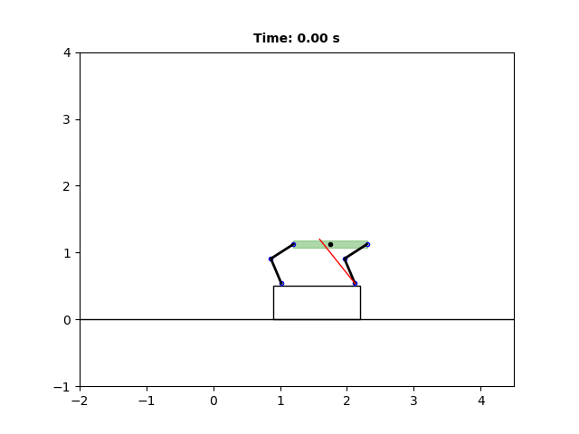

# quadruped-to

Trajectory Optimization for 2D Jumping on Quadruped Robots

Learning many physical interactions and dynamic motions. Future works: to simulate dynamic jumping.

<!--  -->

Jumping:  
 
Backflip:  

